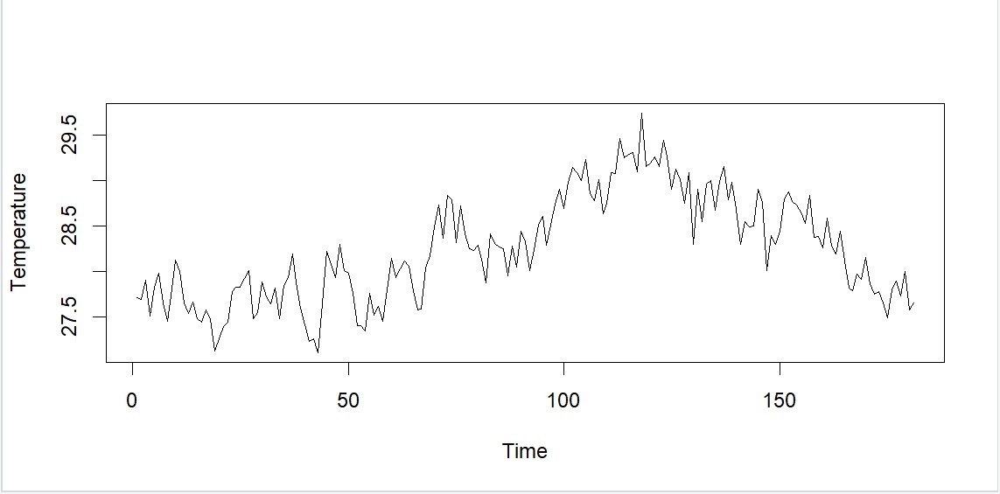
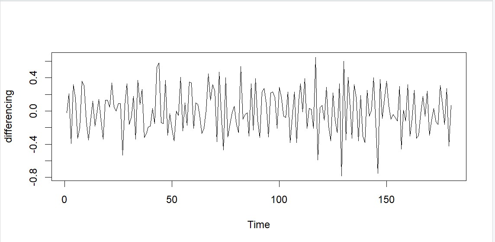

# Time-Series
**Non Seasonal ARIMA for Temperature data**
  Source Data       : https://power.larc.nasa.gov/data-access-viewer/
  Temperature Type  : Earth Skin Temperature (Celsius)
  
  Visualization Result:
  1. Time series plot for temperature data 
      
      The visualization of this time series temperature data still not a stationary data in average, we also can check it with p-value.
  2. Time series plot after differencing (after making the data be a stationary data)
      
      This visualization displaying a stationary data, the p-value of the data also show it because p-value < 0.05.  
  3. Autocorrelation Function (ACF) and Partial Autocorrelation Function (PACF) plots.
      
      With this ACF and PACF plots, we can determine the ARIMA model for this data. The temporary hypothesis for this ARIMA model is ARIMA (0, 1, 2).
      
   ***The result that show above is still need to improve and still temporary***
      
